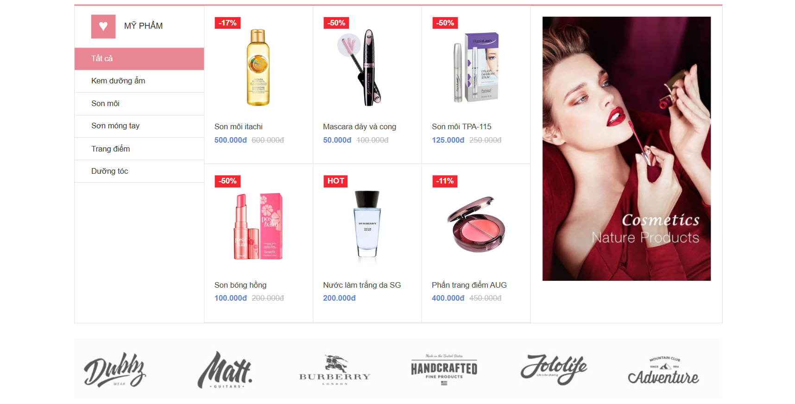

Cosmetics Shop - Node.js

Giao diện cửa hàng mỹ phẩm dựa theo ảnh mẫu, xây dựng bằng:

Node.js

Express.js

EJS

HTML/CSS

Hình ảnh: 

Chạy project
npm install
npm start

Sau đó mở:

http://localhost:3000

Trong quá trình code có thể dùng:

npm run dev

Cấu trúc
cosmetics-nodejs/
├── public/
│   ├── css/
│   │   └── style.css
│   └── images/
│       ├── banner.jpg
│       ├── brands.jpg
│       └── product1.jpg ... product6.jpg
├── views/
│   └── index.ejs
├── package.json
├── server.js
└── README.md